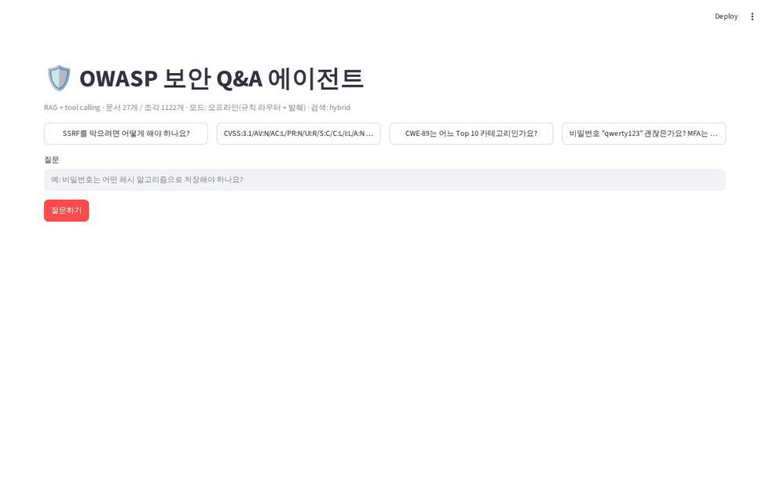
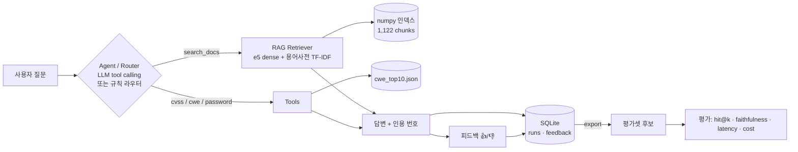
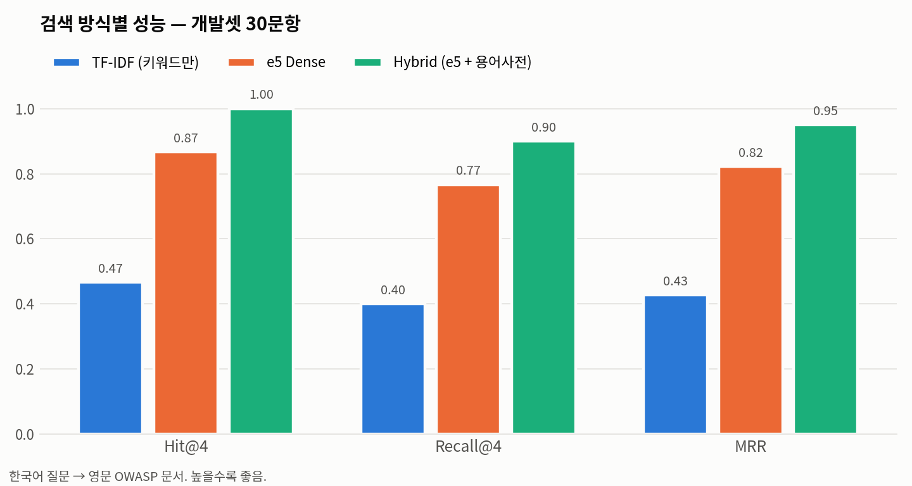
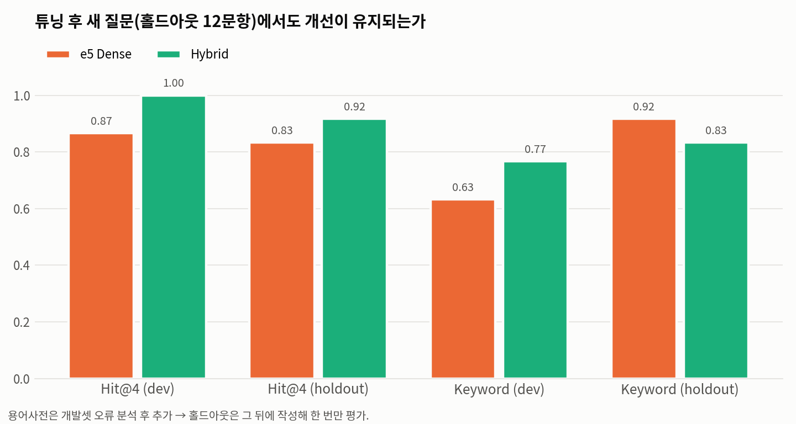
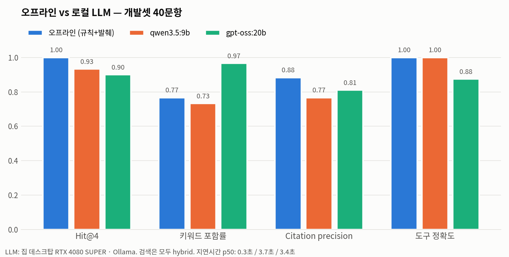

# agentic-knowledge-triage — OWASP 보안 Q&A 에이전트

[](https://github.com/bestevan01/iyuno-agent-portfolio/actions/workflows/ci.yml)


OWASP 공개 보안 문서 27개를 근거로 **한국어 질문에 출처와 함께 답하는 AI 에이전트**입니다.
CVSS 점수 계산, CWE 조회, 비밀번호 정책 검사는 LLM이 짐작하지 않고 **도구를 호출**해서 처리합니다.

채용공고 **Iyuno — AI Agent Engineer**의 요구사항을 "작동하는 증거"로 옮긴 포트폴리오 프로젝트입니다.



---

## 1. 채용공고 요약

| 항목 | 내용 |
|---|---|
| 회사 / 포지션 | Iyuno · AI Agent Engineer (서울 · Hybrid · Full-time) |
| 공고 번호 / 마감 | JR101122 / 2026-09-30 |
| 링크 | https://iyuno.wd3.myworkdayjobs.com/careers/job/seoul/ai-agent-engineer_jr101122 |
| 주요 요구사항 | LLM 기반 AI Agent 설계·개발 · RAG 검색·응답과 tool calling · API·DB 통합과 다단계 workflow · 평가·피드백 루프 · latency·cost·reliability 개선 |

> 공고 내용은 수업 자료(2026년 9월 기준)에서 옮겼습니다.

## 2. 요구사항 ↔ 구현 매핑

| # | 공고 요구사항 | 이 저장소에서의 증거 | 위치 |
|---|---|---|---|
| 1 | LLM 기반 AI Agent 설계·개발 | OpenAI 호환 Chat Completions + tool calling 루프(최대 4단계). LLM 없이도 도는 규칙 라우터를 같은 인터페이스로 제공 | `agent/agent.py` |
| 2 | RAG 검색·응답 시스템 | 수집 → 헤딩 단위 chunking(1,122개) → 다국어 e5 임베딩 → hybrid 검색 → `[n]` 인용과 출처 링크 | `agent/ingest.py`, `agent/retriever.py` |
| 3 | Tool calling | `search_docs`, `cvss_calculator`(FIRST v3.1 수식), `cwe_lookup`(196개), `password_policy_check`(OWASP 기준) | `agent/tools.py` |
| 4 | API·데이터베이스 통합, 다단계 workflow | FastAPI `/ask` `/feedback` `/stats` + SQLite 실행 로그·피드백 저장소. CWE 조회 → 해당 Top 10 문서 검색 → 인용처럼 도구를 연쇄 호출 | `app/api.py`, `agent/feedback.py` |
| 5 | 평가 | 개발셋 40문항 + 홀드아웃 12문항. Hit@k·Recall@k·MRR·키워드 포함률·faithfulness·citation precision·도구 정확도·거절률·지연시간·토큰·비용 | `evaluation/` |
| 6 | 피드백 루프 | 👍/👎 + 수정 의견 → SQLite → `python -m agent.feedback export`로 평가셋 후보 생성 | `agent/feedback.py` |
| 7 | latency·cost·reliability | 요청별 지연시간·토큰·비용 기록, `/stats`에서 p50/p95 확인. 검색 점수가 낮으면 답변 거절. 도구 오류는 모델에 되돌려 재시도. pytest 32개 + CI | `agent/agent.py`, `.github/workflows/ci.yml` |

## 3. 아키텍처



```
agent/        에이전트 핵심 (설정, 수집·chunking, 검색, 도구, 에이전트 루프, 피드백/로그)
app/          FastAPI 서버, Streamlit 데모
data/         원문 27개, CWE 매핑, 흔한 비밀번호 목록, 미리 빌드한 인덱스
evaluation/   평가셋, 평가 스크립트, 결과(metrics.json), 그래프, 오류 분석
scripts/      문서 수집 스크립트
tests/        pytest (TF-IDF 인덱스 + 가짜 LLM 클라이언트로 외부 의존 없이 실행)
```

## 4. 설치와 실행

```bash
git clone https://github.com/bestevan01/iyuno-agent-portfolio.git
cd iyuno-agent-portfolio
python -m venv .venv && source .venv/bin/activate
pip install -r requirements.txt -r requirements-dev.txt

make demo    # Streamlit 데모 → http://localhost:8501
make api     # FastAPI → http://localhost:8000/docs
make test    # pytest
```

- 인덱스(`data/index/`)는 저장소에 포함돼 있어 바로 실행됩니다. 처음 실행하면 임베딩 모델(약 470MB)을 Hugging Face에서 내려받습니다.
- 다시 만들 때: `make fetch`(문서 재수집) → `make index`(2코어 CPU 기준 약 2분).

### LLM 연결 (선택)

LLM 설정이 없으면 오프라인 모드(규칙 라우터 + 근거 문장 발췌)로 동작합니다.
OpenAI 호환 엔드포인트라면 무엇이든 연결할 수 있습니다.

```bash
# 로컬 Ollama 예시 (tool calling을 지원하는 모델)
export LLM_BASE_URL=http://localhost:11434/v1
export LLM_MODEL=qwen3.5:9b
make demo
make eval-llm     # LLM 모드 평가 + LLM 판정 faithfulness
```

유료 API를 쓸 때는 `LLM_PRICE_IN_PER_M`, `LLM_PRICE_OUT_PER_M`(1M 토큰당 USD)을 넣으면 비용 지표가 계산됩니다.
키는 환경변수로만 받고 저장소에는 넣지 않습니다(`.env.example` 참고).

### API 예시

```bash
curl -s localhost:8000/ask -H 'content-type: application/json' \
  -d '{"question":"CVSS:3.1/AV:N/AC:L/PR:N/UI:R/S:C/C:L/I:L/A:N 는 몇 점?"}'
# → "CVSS v3.1 Base Score는 **6.1 (Medium)** 입니다." + tool_calls, latency_ms, tokens, cost_usd

curl -s localhost:8000/stats
# → {"runs": ..., "latency_ms_p50": ..., "latency_ms_p95": ..., "tokens_total": ..., "cost_usd_total": ..., "feedback": {...}}
```

## 5. 평가 결과

`evaluation/metrics.json` (요약) · `evaluation/results/<run>/` (문항별 결과) · 재현: `make eval && make eval-ablation`

**기본 설정**(오프라인 모드, hybrid 검색, k=4) 결과:

| 구분 | 지표 | 개발셋 (40) | 홀드아웃 (12) |
|---|---|---|---|
| 검색 | Hit@4 / Recall@4 / MRR | **1.00** / 0.90 / 0.95 | **0.92** / 0.92 / 0.88 |
| 답변 | 키워드 포함률 | 0.77 | 0.83 |
| 답변 | Faithfulness (proxy) | 0.99 | 0.98 |
| 답변 | Citation precision | 0.88 | 0.79 |
| 도구 | 선택 정확도 / 결과 정확도 | 1.00 / 1.00 (8문항) | – |
| 거절 | 범위 밖 질문 거절 | 1.00 (2문항) | – |
| 운영 | 지연시간 p50 / p95 | 321 ms / 509 ms | 371 ms / 450 ms |
| 운영 | 토큰 / 비용 | 0 / $0 (오프라인) | – |

**검색 방식 비교 (개발셋 RAG 30문항)**

| 검색 방식 | Hit@4 | Recall@4 | MRR | 키워드 포함률 |
|---|---|---|---|---|
| TF-IDF (키워드만) | 0.47 | 0.40 | 0.43 | 0.30 |
| e5 dense | 0.87 | 0.77 | 0.82 | 0.63 |
| **Hybrid (e5 + 용어사전 TF-IDF)** | **1.00** | **0.90** | **0.95** | **0.77** |




- 한국어 질문으로 영문 문서를 찾아야 해서 키워드 검색만으로는 절반도 맞히지 못했습니다. 다국어 임베딩(e5)이 필수였습니다.
- 용어사전은 개발셋 오류 분석 후에 추가했습니다. 그래서 튜닝이 끝난 뒤 **홀드아웃 12문항을 새로 작성해 한 번만** 평가했고, 여기서도 Hit@4가 0.83 → 0.92로 개선이 유지됐습니다.
- 자세한 실패 사례와 원인은 [`evaluation/error_analysis.md`](evaluation/error_analysis.md)에 정리했습니다.

### LLM 모드 (집 데스크탑 RTX 4080 SUPER · Ollama)

같은 개발셋 40문항을 로컬 LLM 두 개로 돌린 결과입니다. 검색은 모두 hybrid입니다.

| 지표 | 오프라인 (규칙+발췌) | qwen3.5:9b | gpt-oss:20b |
|---|---|---|---|
| Hit@4 / MRR | **1.00** / **0.95** | 0.93 / 0.92 | 0.90 / 0.76 |
| 키워드 포함률 | 0.77 | 0.73 | **0.97** |
| Faithfulness (LLM 판정) | – | 0.93 | 0.82 |
| Citation precision | **0.88** | 0.77 | 0.81 |
| 도구 결과 정확도 | 8/8 | 8/8 | 7/8 |
| 범위 밖 거절 / 잘못된 거절 | 2/2 / 0 | 2/2 / 1/30 | 2/2 / 0 |
| 빈 답변 | 0 | 1/40 (수정 전) | 0 (수정 후 재실행) |
| 지연시간 p50 / p95 | 0.3초 / 0.5초 | 3.7초 / 6.3초 | 3.4초 / 5.7초 |
| 토큰 (문항당 평균) | 0 | 2,434 | 2,708 |
| 비용 | $0 | $0 (로컬) | $0 (로컬) |

홀드아웃 12문항: qwen Hit@4 0.92 · 키워드 0.92 · 판정 1.00 / gpt-oss Hit@4 0.83 · 키워드 0.92 · 판정 0.97



- **LLM은 답을 한국어로 다시 써서** 키워드 포함률이 올라갑니다(gpt-oss 0.97). 반면 검색어를 모델이 직접 만들어서 검색 순위(MRR)는 오프라인보다 낮습니다.
- **빈 답변 버그를 평가로 찾았습니다.** gpt-oss는 검색을 4번 부른 뒤, qwen은 비밀번호 도구를 부른 뒤 아무 말도 하지 않은 경우가 한 번씩 있었습니다. 두 가지를 고쳤습니다. 도구 호출 한도에 도달하면 "지금까지 결과로 답하라"고 지시하고, 그래도 비어 있으면 규칙 기반 답변으로 대체합니다(테스트 2개 추가). gpt-oss로 다시 돌린 결과 빈 답변은 0건이었습니다.
- **같은 모델도 실행마다 달라집니다.** gpt-oss 첫 실행에서는 도구 8/8이었는데, 재실행에서는 CWE-918 질문에 `cwe_lookup` 대신 문서 검색으로 답했습니다(답 자체는 맞음). temperature 0.2라도 도구 선택이 흔들립니다.
- **LLM 판정은 모델이 자기 답을 채점한 값입니다**(qwen은 qwen이, gpt-oss는 gpt-oss가 판정). 모델 간 비교에는 쓰지 말고, 같은 모델 안에서 추세를 보는 용도로만 봐야 합니다.

## 6. 한계 (정직하게)

1. **LLM 판정 faithfulness는 자기 채점입니다.** 답변한 모델이 스스로 판정하므로 후하게 나올 수 있습니다. 더 큰 모델이나 사람이 따로 채점해야 제대로 비교할 수 있습니다.
2. **오프라인 답변은 원문 발췌라 영어입니다.** 또 "무엇이 위험한가" 문장을 "어떻게 막는가" 대신 고르는 경우가 있습니다(키워드 포함률 0.77의 주된 원인).
3. **임베딩 기반 faithfulness(proxy)는 LLM 답변에 쓸 수 없습니다.** 한국어로 바꿔 쓴 틀린 문장도 영문 근거와 유사도가 높게 나와 사실 여부를 가르지 못합니다. 또 실제 LLM 답변은 문장 단위 유사도가 기준(0.90)에 거의 닿지 않아 0.00~0.01이 나왔습니다. 그래서 LLM 모드는 LLM 판정 값만 봅니다.
4. **평가셋이 작습니다**(RAG 42문항, 범위 밖 2문항). 문항과 정답 문서를 프로젝트 안에서 직접 만들었기 때문에 출제 편향이 있을 수 있습니다.
5. **hub 문서 문제.** 조각이 가장 많은 CSRF Cheat Sheet가 관련 없는 질문의 검색 결과에도 자주 끼어듭니다. 문서별 상한이나 MMR로 개선할 여지가 있습니다.
6. **범위.** 문서는 OWASP Top 10 2021과 Cheat Sheet 16종뿐입니다. 2025년판 Top 10, CVE 실시간 조회, 사내 정책 문서는 다루지 않습니다.
7. **거절 임계값(0.78)** 은 임베딩 모델에 종속된 값입니다. 모델을 바꾸면 다시 보정해야 합니다.

## 7. 보안·개인정보 처리

- 비밀번호 검사 도구의 입력값은 실행 기록과 SQLite 로그에서 `*`로 가립니다(`mask_args`, `redact`). 이 동작은 테스트로 검증합니다.
- API 키는 환경변수로만 받고, `.env`는 git에서 제외합니다.
- 데이터는 모두 공개 문서입니다. 개인정보나 회사 내부자료는 사용하지 않았습니다.

## 8. 데이터 출처·라이선스

- 코드: MIT (`LICENSE`)
- 문서: OWASP Top 10 2021 · OWASP Cheat Sheet Series — CC BY-SA 4.0, 흔한 비밀번호 목록: SecLists — MIT
- 문서별 URL, 커밋, 수집일(2026-09-28)은 [`data/README.md`](data/README.md)와 `data/sources.json`에 있습니다.

## 9. AI 활용 방식

과제 요구사항에 따라 AI 코딩 도우미(Claude)와 대화하며 만들었습니다.
AI가 쓴 코드와 수치는 그대로 믿지 않고, 아래 방법으로 확인했습니다.

| AI가 한 일 | 검증 방법 |
|---|---|
| 폴더 구조, 코드·테스트 초안 | pytest 32개와 ruff 린트를 CI에서 매 커밋마다 실행 |
| CVSS v3.1 수식 구현 | 알려진 예시 벡터 7개(9.8, 10.0, 6.1, 7.8, 5.9, 1.6, 0.0)와 결과 대조 |
| 평가 문항 초안 | 기대 키워드가 정답 문서 원문에 실제로 있는지 grep으로 확인. 튜닝 뒤에 홀드아웃을 따로 작성 |
| 지표 설계 | faithfulness 임계값을 음성 대조군으로 보정하고, 보정이 안 되는 경우(한국어 부정문)를 한계로 기록 |
| 거절 판정 규칙 | LLM 답변을 직접 읽어 보니 오판이 있었음("답변을 제공할 수 없습니다"를 놓치고, 인용 달린 정상 답변을 거절로 셈) → 기준을 "거절 표현 + 인용 없음"으로 고치고 모든 실행을 `rescore.py`로 재채점 |
| README·오류 분석 초안 | 모든 수치를 `evaluation/results/*/metrics.json`과 대조 |

사용한 프롬프트 흐름: 요구사항 → 폴더 구조·README 초안 → RAG retriever 구현 → 도구·tool calling 추가 → pytest·CI 작성 → 오류 로그 분석·수정 → 평가 결과·한계를 README에 반영.

회고는 [`RETROSPECTIVE.md`](RETROSPECTIVE.md)에 있습니다.
